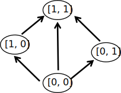

## What is PosetMage

What's a **Partially Ordered Set**?

Imagine you're organizing numbers. You know 1 is less than 3 (1 < 3), and 3 is less than 5 (3 < 5). That means 1 is also less than 5 (1 < 5)!  That's the core idea of a **Partially Ordered Set**.

A Partially Ordered Set is just a way to show how things are related, where some things "come before" others. Not *everything* needs to be directly compared – it's like a skill tree in a game. You need some skills before you can get others, but you might be able to choose between different paths.

What's **Partially Ordered Magic**?

To learn high-level magic, you need to learn low-level magic first. It's a Skill Tree!  The sequence of skills is based on a Partially Ordered Set.  So, Partially Ordered Magic *is* the Skill Tree!

**PosetMage**, the Short chant(短縮詠唱)

In battle, there's no time for long spells! We need to shorten incantations. PosetMage is about shortening incantations for your Partially Ordered Magic!

Sub-Brands of PosetMage:

##  HomunMage:
Inspired by the Homunculus, an artificial creation, HomunMage focuses on **entrepreneurship and technology**. Covering areas such as **AI, startups, programming, and innovation**, it provides a magical framework for building new possibilities. HomunMage embodies the ingenuity of technological creation and enterprise.

##  LatticeMage:
Inspired by the concept of a lattice, representing interconnected structures, LatticeMage emphasizes mastery in the **natural sciences**. Serving professionals and enthusiasts in fields such as **physiology, psychology, neuroscience, mathematics, physics**, as well as strategic disciplines like **MMA, poker, and Go**, it symbolizes the layered pathways of structured knowledge. LatticeMage embodies the rigor and interconnectedness of scientific and strategic thought.

##  森羅Mage:
「森羅万象」に由来し、森羅Mage は **ACGN ファン** に捧げられています。対象は特に **芸術関連の専攻** に属する人々で、ACGN 文化と **ゲームデザイン、美術、音楽、DnD** などの創造的な活動を融合します。森羅Mage は没入的で文化的な表現を探求するための魔術体系を体現します。

##  鍊金Mage:
象徵着如同賢者之石般的「轉化」，鍊金Mage 著重於 **生活、休閒、社會時事與人文史地**。它融合多元領域的智慧，從日常經驗到社會觀察，提供洞察與策略。鍊金Mage 具現了社會中知識轉化的力量。
